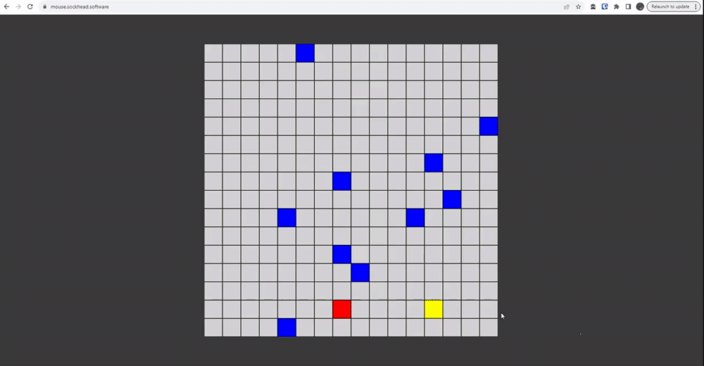

# Mouse Movement dataset gathering
### The purpose of this small web application is to gather data from user interaction, and communicate that data with a server. The data is to be stored in a database to later train an ML model to replicate human-like mouse behaviour.

The front end is a simple frameworkless tool for data gathering, nothing fancy. Its supported by a backend written in GO, which stores the data in a mongo database.  

1. Hover the blue circle until it turns green
2. Move the cursor to the red circle, and click anywhere inside it to store the data and reset the circles.
3. Repeat as many times as you wish.



JSON post data structure:

```
{
    "window-height": 962,
    "window-width": 1305,
    "mouse-array": [
        {
            "x": 0.25440613026819925,
            "y": 0.4896049896049896,
            "time": 1698217375839
        },
        {
            "x": 0.25517241379310346,
            "y": 0.4896049896049896,
            "time": 1698217375855
        },
        {
            "x": 0.2582375478927203,
            "y": 0.4864864864864865,
            "time": 1698217375864
        },
        {
            "x": 0.2674329501915709,
            "y": 0.4812889812889813,
            "time": 1698217375873
        }
    ]
}
```

<br>
coordinate data is normilized by calculating against the client window size   

polling is performed at an interval set in the javascript