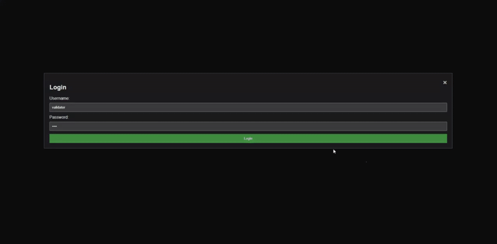

# Mouse Movement dataset gathering and Generative Adversarial Network training

### The purpose of this application is to gather data to train an ML model to replicate human-like cursor movement behaviour.

TODO:

1. [ ] Data validation in go (at least to enforce proper data structure before inserting into db)
2. [x] Media query? disallow data from touch screen devices
3. [x] Env variables etc in go to remove sensitive data in repo
4. [ ] Pull data from mongo into GAN training set files
5. [ ] Train model
6. [ ] Generate and test the model's output using pyinput or similar to simulate human-like cursor
       movement
7. [ ] Complete data approval error handling

<br>

# Data Gathering:

https://mouse.sockhead.software/

The front end is a simple frameworkless tool for data gathering, nothing fancy. Its supported by a backend written in GO.

1. Click yellow square, which will turn green.
2. Move the cursor to the red square, and click again.
3. Repeat as many times as you wish.


<br>
<br>
<br>

# Data Approval:


Datapoints can be approved or removed from the inital DB, and approved data is submitted and stored in an "approved" database, for cleaner data. There is an authorized endpoint that easily allows authorized users to view and vet each data point.

## Development

Create a new .env file in the server directory:  
<br>
/server/.env

```
MONGO_URI=
DEVELOPMENT=
VALIDATION_USER=
VALIDATION_PWD=
```
